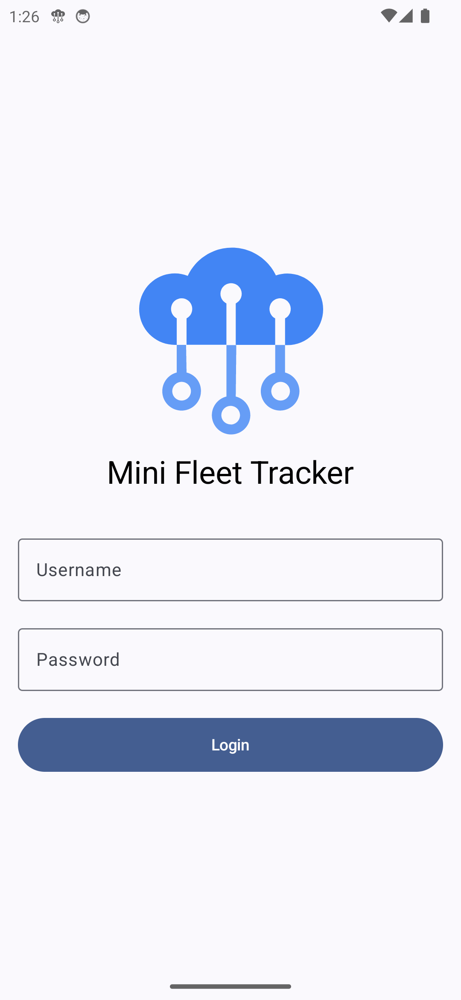
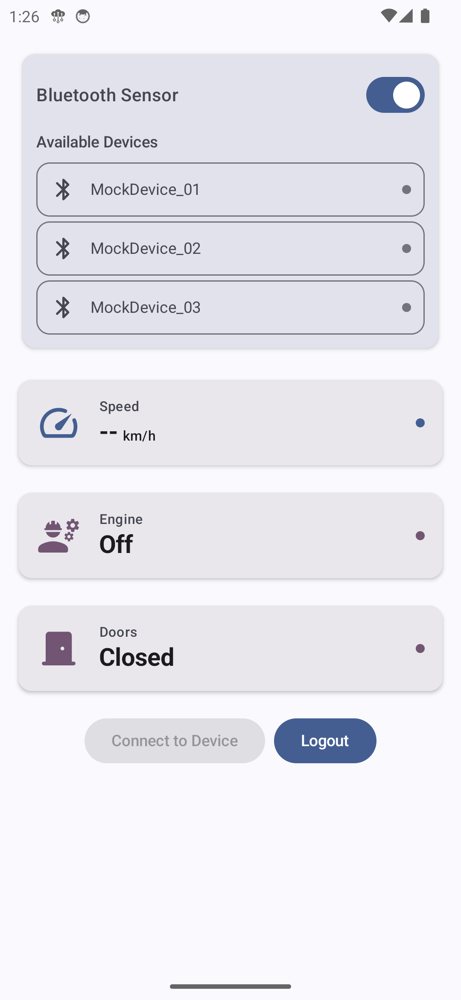
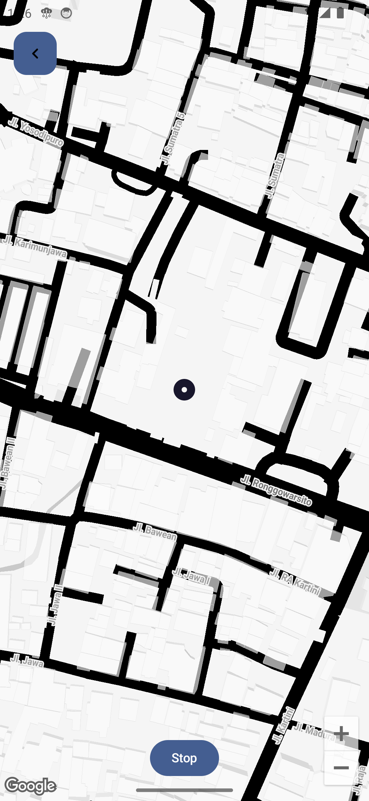
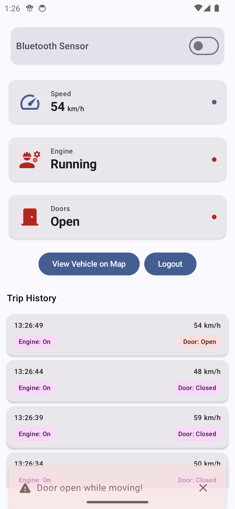

# MiniFleet - Vehicle Tracking System

An Android app for real-time vehicle tracking with IoT sensor simulation, written in Kotlin using Jetpack Compose and Clean Architecture.

## Screenshots

<table style="padding:10px">
  <tr>
    <td></td>
    <td></td>
  </tr>
  <tr>
    <td></td>
    <td></td>
  </tr>
</table>

## Features

- **Login System**:
  - Username: `admin`
  - Password: `admin123`

- **Clean Architecture** with 3 main modules:
  - Data (database, API, preferences)
  - Domain (business logic and models)
  - Presentation (UI with MVI pattern)

- **Modern Tech Stack**:
  - Jetpack Compose for declarative UI
  - Koin for dependency injection
  - Kotlin Flows for reactive programming
  - WorkManager for background tasks
  - Google Maps SDK for location tracking

- **Real-time Vehicle Simulation**:
  - Simulates speed, engine status, door sensors
  - Configurable route patterns
  - Background operation support

- **Alert System**:
  - Speed threshold warnings (>80 km/h)
  - Door-open-while-moving detection
  - Engine status changes
  - Both in-app and push notifications

- **Additional Features**:
  - Dark/Light theme support
  - Permission handling (notifications)
  - Trip History (local database)
  - Edge-to-edge UI
  - Responsive design for all screen sizes

## Technical Implementation

### Code Structure
- **Modular** design with feature separation
- **MVI** (Model-View-Intent) pattern for UI
- **Repository** pattern for data access
- **SOLID** principles

### Libraries Used
```gradle
# Core
implementation(libs.androidx.core)
implementation(libs.androidx.lifecycle)
implementation(libs.androidx.activity.compose)

# UI
implementation(libs.androidx.compose.ui)
implementation(libs.androidx.compose.material3)
implementation(libs.androidx.navigation.compose)

# Koin Dependency Injection
implementation(libs.koin.android)
implementation(libs.koin.compose)

# Maps
implementation(libs.google.maps)
implementation(libs.maps.compose)

# Background
implementation(libs.androidx.work)

# Local
implementation(libs.room.ktx)
ksp(libs.room.compiler)
```

#### Getting Started
Prerequisites
Android Studio Koala or later

Google Maps API key

Installation
Clone the repository:

```sh
git clone https://github.com/galahseno/MiniFleet.git
```
Add your Google Maps API key:

Create local.properties in root directory

Add the following line:

```sh
MAPS_API_KEY="your_api_key"
```
Build and run the app in Android Studio
